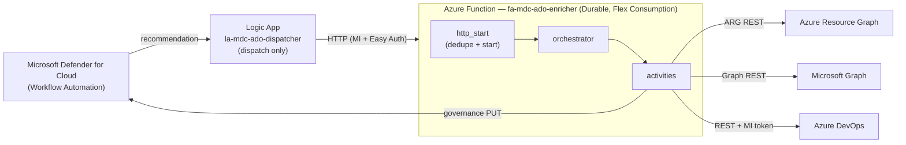

# MDC → ADO Connector

Turn **Microsoft Defender for Cloud (MDC)** Security Recommendations into **enriched Azure
DevOps (ADO) Work Items** — automatically, with a decision-ready "Triage Briefing" and a
back-reference written into MDC so the recommendation shows as **Assigned**.

> Auth is **Managed Identity end-to-end** — no PAT, no Key Vault in the baseline. Hosting is
> Azure Functions **Flex Consumption**.

---

## What it does

When MDC raises a Security Recommendation, a Workflow Automation forwards it to a thin **Logic
App dispatcher**, which calls an **Azure Function** (Python 3.12, Durable Functions). The Function:

1. **De-duplicates** against existing Work Items (deterministic instance id + ADO WIQL lookup).
2. **Enriches** the recommendation from Azure Resource Graph and Microsoft Graph — other open
   recommendations, governance owner, resource facts, attack paths, CVEs, criticality, exposure.
3. **Renders** an HTML Triage Briefing (blast-radius context, clickable portal links).
4. **Creates or churn-controlled-updates** an ADO Work Item.
5. **Writes back** to MDC, stamping an `ado-wi-<id>` governance back-reference (optional, gated).

Every enrichment call degrades gracefully — the Work Item is always created.



See [docs/ARCHITECTURE.md](docs/ARCHITECTURE.md) for the full design and
[docs/TSD-MDC-ADO-001-v2.0.md](docs/TSD-MDC-ADO-001-v2.0.md) for the formal spec.

---

## Repository layout

```
infra/                 Bicep IaC (+ compiled main.json ARM template) and the ADO schema script
  main.bicep             resource-group deployment, wires six modules
  main.json              compiled ARM template (powers the "Deploy to Azure" button)
  modules/               managed-identity, storage, app-insights, function-app, logic-app, key-vault
  parameters/            *.bicepparam.example templates (copy → fill in)
  ado/                   provision_ado_process.py — one-off ADO process/work-item-type provisioning
src/
  function/              Python 3.12 Durable Functions app (models, clients, activities, orchestrator)
  logic-app/             workflow.json (dispatch-only definition)
tests/                   unit tests + sample MDC payload fixtures
scripts/check-runs.sh    ops triage: map Logic App runs → recommendations → Work Items
docs/                    ARCHITECTURE.md, DEPLOYMENT.md, TSD
```

---

## Deploy

Full step-by-step (prerequisites, app registration, ADO schema, roles, code publish, MDC wiring,
testing, teardown) is in **[docs/DEPLOYMENT.md](docs/DEPLOYMENT.md)**. Two paths:

### Option A — Portal ("Deploy to Azure")

Deploys the **infrastructure** straight from this folder's ARM template. After it completes you
still publish the Function code and complete the one-time manual steps (see DEPLOYMENT.md).

[](https://portal.azure.com/#create/Microsoft.Template/uri/https%3A%2F%2Fraw.githubusercontent.com%2FAzure%2FMicrosoft-Defender-for-Cloud%2Fmain%2FWorkflow%2520automation%2FMDC-Recommendations-to-AzureDevOps-Connector%2Finfra%2Fmain.json)

### Option B — CLI (clone + script)

Clone the repository and work from this connector folder:

```bash
git clone https://github.com/Azure/Microsoft-Defender-for-Cloud.git
cd "Microsoft-Defender-for-Cloud/Workflow automation/MDC-Recommendations-to-AzureDevOps-Connector"

# 1. Provision the ADO process / work-item type (dry-run first; then --apply)
python infra/ado/provision_ado_process.py --org <your-org> --project <your-project>
python infra/ado/provision_ado_process.py --org <your-org> --project <your-project> --apply

# 2. Deploy infrastructure
cp infra/parameters/dev.bicepparam.example infra/parameters/dev.bicepparam   # then edit values
az group create -n rg-mdc-ado-dev -l eastus
az deployment group create -g rg-mdc-ado-dev \
  --template-file infra/main.bicep \
  --parameters infra/parameters/dev.bicepparam

# 3. Publish the Function code
cd src/function && func azure functionapp publish fa-mdc-ado-enricher --python
```

Then assign the managed-identity roles, add the MI to your ADO org/project, and wire MDC Workflow
Automation → the Logic App, as described in **[docs/DEPLOYMENT.md](docs/DEPLOYMENT.md)**.

> **Required to trigger on real recommendations:** deploying the infrastructure does **not** make
> Defender for Cloud send anything. You must create an **MDC Workflow Automation** whose trigger is
> *Security recommendations* and whose action is the Logic App `la-mdc-ado-dispatcher`. Without it,
> the connector only runs when you POST a payload to the Logic App manually. See
> [docs/DEPLOYMENT.md](docs/DEPLOYMENT.md) §7.

---

## Local development

Requires Python 3.12 and (for local Functions runs) Azure Functions Core Tools v4.

```bash
python -m venv .venv && source .venv/bin/activate
python -m pip install -e ".[dev]" -r src/function/requirements.txt

ruff check src/ tests/        # lint
ruff format --check src/ tests/
mypy --strict src/            # type-check
pytest tests/ -q              # tests (all external I/O mocked)
```

Sample MDC payloads for tests live in [tests/fixtures/sample_payloads/](tests/fixtures/sample_payloads/).

---

## License

Licensed under the [MIT License](../../LICENSE) of this repository.
