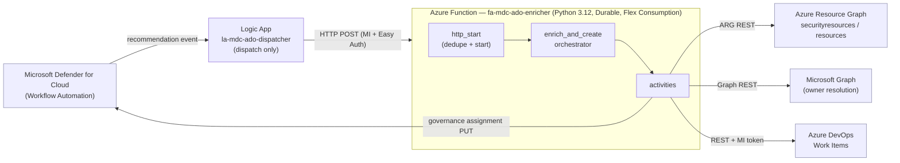
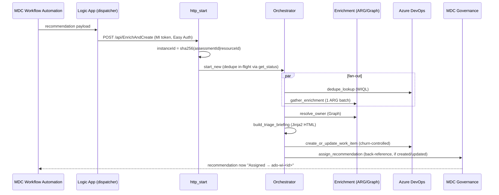

# MDC → ADO Connector — Architecture & Operations

> Companion to the formal spec [TSD-MDC-ADO-001-v2.0](TSD-MDC-ADO-001-v2.0.md). This document
> describes the connector as **actually built and verified**: its components, the macro
> architecture, how a recommendation flows end-to-end, and which parts are working today.

---

## 1. What it does

When Microsoft Defender for Cloud (MDC) raises a **Security Recommendation**, this connector
automatically creates an **enriched Azure DevOps (ADO) Work Item** — a decision-ready "Triage
Briefing" with blast-radius context — and writes a back-reference into MDC so the recommendation
shows as **Assigned** to that Work Item.

The goal is to eliminate the manual pivoting (ARG, MDC portal, Graph) an engineer would otherwise
do per ticket, and to close the loop back to MDC.

---

## 2. Macro architecture



**Why a Logic App *and* a Function?** MDC Workflow Automation can only target a Logic App, but the
Logic App is too constrained for multi-source enrichment. So the Logic App is reduced to a thin
**dispatcher** that forwards the payload; all logic lives in the Function.

**Why Durable Functions?** The Function fans out several enrichment calls in parallel, needs
built-in retries, deterministic dedupe, and status queryability — all native to Durable.

**Auth is Managed Identity end-to-end** — no PAT, no Key Vault in the baseline.

---

## 3. End-to-end flow



1. **Dispatch.** Logic App filters (severity/scope) and forwards the raw assessment payload to the
   Function over HTTP, authenticating with its Managed Identity (Easy Auth gates the Function).
2. **Idempotent start.** `http_start` computes a deterministic instance id
   `sha256(assessmentId|resourceId)` and starts the orchestration; an already in-flight instance for
   the same key is treated as a duplicate (active-states allowlist).
3. **Fan-out.** The orchestrator runs **dedupe lookup** (ADO WIQL) and **enrichment** (one batched
   ARG query) in parallel.
4. **Owner.** `resolve_owner` takes the owner surfaced by enrichment and refines it via Microsoft
   Graph.
5. **Briefing.** `build_triage_briefing` renders the HTML "Triage Briefing".
6. **Write.** `create_or_update_work_item` creates a new Work Item or applies a **churn-controlled
   update** (only on material change).
7. **Write-back.** `assign_recommendation` stamps the Work Item back-reference into MDC's governance
   assignment (sets the recommendation **Assigned**), unless it is already assigned to a human.

Every external call degrades gracefully: missing enrichment leaves a placeholder; the Work Item is
always created.

---

## 4. Components

### 4.1 Logic App — `la-mdc-ado-dispatcher` (dispatch only)
- Request trigger `When_an_MDC_recommendation_arrives` + MSI-authenticated HTTP forward to the
  Function + a failure-notification compose. **No business logic.**
- Definition: [src/logic-app/workflow.json](../src/logic-app/workflow.json).

### 4.2 Azure Function — `fa-mdc-ado-enricher`
Python 3.12, Azure Functions v2 (decorator) programming model, Durable Functions, Flex Consumption.

| Module | Responsibility |
|---|---|
| [function_app.py](../src/function/function_app.py) | HTTP starter; registers blueprints; deterministic instance id + in-flight dedupe; Easy Auth (ANONYMOUS + Entra gate). |
| [orchestrators/enrich_and_create.py](../src/function/orchestrators/enrich_and_create.py) | Durable orchestrator: fan-out → owner → briefing → create/update → write-back. Pure/deterministic generator. |

**Activities** ([src/function/activities/](../src/function/activities/)):

| Activity | Purpose | On failure |
|---|---|---|
| `dedupe_lookup` | ADO WIQL on `Custom.MDCAssessmentId` + `Custom.MDCResourceId` (state ≠ Done) → existing WI id or `None`. | degrades to `None` |
| `gather_enrichment` | One batched ARG query → decompose by `signalKind` → `EnrichmentBundle`. Drops our own `ado-wi-*` governance owners (feedback-loop guard). | degrades to empty bundle |
| `resolve_owner` | Owner email/tag → Microsoft Graph user → `OwnerInfo` (`tag`/`graph`/`unknown`). | degrades to tag/unknown |
| `build_triage_briefing` | Render the HTML briefing via Jinja2; `strip_html` filter cleans MDC HTML fragments to plain text. | pure, no I/O |
| `create_or_update_work_item` | Create the Work Item, or churn-controlled update (compare `Custom.MaterialHash`). Priority/DueDate by severity. | **raises** → Durable retry |
| `assign_recommendation` | Write-back: PUT MDC governance assignment `owner = ado-wi-<id>@<domain>` (sets Assigned). Gated, idempotent, skips on 409. | degrades (never fails the WI) |

**Clients** ([src/function/clients/](../src/function/clients/)) — all thin async `httpx` REST wrappers
with token caching, `tenacity` retries, and OpenTelemetry spans:

| Client | Talks to | Notes |
|---|---|---|
| `arg_client` + `arg_queries` | Azure Resource Graph | ARM MI token; sliding-window throttle; `$skipToken` pagination; composable KQL + `union_queries` (`<head> \| union (…)` form). |
| `graph_client` | Microsoft Graph | `resolve_user(email)`; 404 → `None` (best-effort). |
| `ado_client` | Azure DevOps REST 7.1 | MI Entra token (resource `499b84ac-…`); JSON Patch; refresh on 401. |
| `mdc_client` | MDC management plane (ARM) | `assign_governance` PUT, `api-version=2025-05-04`; 409 → `MdcAssignmentConflictError`. |

**Models** ([src/function/models/](../src/function/models/)) — pydantic v2, frozen:

| Module | Contents |
|---|---|
| `mdc_payload` | `MdcRecommendationPayload` + helpers: `resource_id`, `subscription_id`, `resource_group`, `resource_type`, `severity`, `recommendation_url`, `resource_portal_url`, `assessment_resource_id`. |
| `enrichment` | `EnrichmentBundle` and per-signal models (owner, other-recs, attack paths, vulnerabilities, criticality, exposure). All optional → graceful degradation. |
| `briefing` | `BriefingInput`; `WorkItemFields` (each field carries its literal ADO reference name); `WorkItemResult`. |

**Template:** [activities/templates/triage_briefing.html.j2](../src/function/activities/templates/triage_briefing.html.j2) — the briefing HTML written to `System.Description`.

---

## 5. Enrichment signals (§4.3)

A single batched ARG request gathers these, decomposed by a `signalKind` discriminator:

| # | Signal | Source | Status |
|---|---|---|---|
| 1 | Other open recommendations | `securityresources` assessments | ✅ working (e.g. 121 on a real VM) |
| 2 | Governance assignments (owner, assigned/unassigned split) | `securityresources` governanceAssignments | ✅ working |
| 3 | Attack paths | `securityresources` attackpaths | ⏸ parked — no attack-path data in the subscription yet |
| 4 | CVE vulnerabilities | `securityresources` subassessments | ⚠️ schema-correct, but no CVE data in dev (only baseline findings) |
| 5 | Suggested owner | governance owner / resource tag → Graph | ✅ working (Graph refine pending MI permission) |
| 6 | Resource criticality | `resources` tag `Criticality` | ✅ working (tag-dependent) |
| 7 | Internet exposure | derived from attack-path risk factors | ⏸ parked (depends on #3) |
| 8 | Resource facts | `resources` (type/sub/RG/location) | ✅ working |

---

## 6. Key behaviors

- **Idempotency / dedupe.** Durable instance id = `sha256(assessmentId|resourceId)`; authoritative
  dedupe is an ADO WIQL lookup on the two `Custom.MDC*` keys. The same recommendation never creates
  a duplicate Work Item.
- **Churn control (§5.2.5).** Updates are gated by `Custom.MaterialHash` (a hash over the material
  fields). No material change → the update is **skipped** (no `LastSeen`-only churn, no comment).
- **Graceful degradation (§5.2.3).** Every enrichment / write-back failure is logged and degrades;
  the Work Item is always created. Only `create_or_update_work_item` raises (so Durable retries).
- **Write-back & feedback-loop guard (§4.7).** The connector stamps `ado-wi-<id>@<domain>` into the
  governance assignment. Enrichment ignores governance owners with the `ado-wi-` prefix, so the
  connector never treats its own back-reference as a human owner. Existing human assignments are
  preserved (a 409 is a clean skip).

---

## 7. Work Item schema

A custom work-item type **`Security Recommendation`** (inherited process **"MDC Security"**,
provisioned by [infra/ado/provision_ado_process.py](../infra/ado/provision_ado_process.py)):

- **16 `Custom.*` fields** — `MDCAssessmentId`, `MDCResourceId`, `Severity`, `SubscriptionId`,
  `ResourceType`, `ComplianceStandards`, `SuggestedOwner`, `Criticality`, `OnAttackPath`,
  `AttackPathCount`, `OtherOpenRecsCount`, `CVECount`, `MaxCVSS`, `FirstDetected`, `LastSeen`,
  `MaterialHash`.
- **Built-ins** — `Microsoft.VSTS.Common.Priority` (1/2/3 by severity),
  `Microsoft.VSTS.Scheduling.DueDate` (SLA 7/30/90 days), `System.Tags`, `System.State`.
- **`System.Description`** — the rendered HTML Triage Briefing (Resource Context, clickable
  Recommendation + Resource links, Blast Radius, Recommendation Detail, Remediation Steps,
  Compliance).

---

## 8. Security & identity

| Principal | Access | For |
|---|---|---|
| Logic App MI | Invoke the Function (Easy Auth) | dispatch |
| Function MI `id-mdc-ado-<env>` | `Reader` + `Security Reader` (subscription) | ARG queries |
| Function MI | `Security Admin` (subscription) | governance write-back (§4.7) |
| Function MI (added as ADO org member) | ADO `Contributor` on the project | Work Item create/update |
| Function MI | Microsoft Graph `User.Read.All` (optional) | owner resolution (not yet granted) |

- **No secrets:** ADO uses an Entra token from the MI; inter-service auth uses Easy Auth + MI. No
  PAT, no Key Vault in the baseline.
- **Storage** is identity-based (no connection strings; Blob/Queue/Table data-plane RBAC).
- Outbound is HTTPS only, to `management.azure.com`, `graph.microsoft.com`, `dev.azure.com`.

---

## 9. Infrastructure (Bicep)

[infra/](../infra/) — `main.bicep` wires six modules:

| Module | Resource |
|---|---|
| `managed-identity` | `id-mdc-ado-<env>` (shared by Function + Logic App) |
| `storage` | `stmdcado<env>` (Durable state, identity-based) |
| `app-insights` | `appi-mdc-ado-enricher` (+ Function-scoped workspace) |
| `function-app` | `fa-mdc-ado-enricher` (Flex Consumption) + Easy Auth + app settings |
| `logic-app` | `la-mdc-ado-dispatcher` |
| `key-vault` | optional, **not** deployed in the baseline |

ADO process schema is provisioned out-of-band by `infra/ado/provision_ado_process.py`.

### Key app settings
`AZURE_CLIENT_ID` (selects the user-assigned MI), `ADO_ORG_URL`, `ADO_PROJECT`,
`MDC_WRITE_BACK_ENABLED`, `MDC_ASSIGNMENT_OWNER_DOMAIN`, `AzureWebJobsStorage__*`,
`APPLICATIONINSIGHTS_CONNECTION_STRING`.

---

## 10. Working parts (verified live)

- ✅ End-to-end pipeline: Logic App → Function → enrichment → ADO Work Item.
- ✅ Enrichment: other open recommendations + governance owner (with Graph refine), resource facts.
- ✅ Dedupe (same recommendation = one Work Item) and churn-controlled updates.
- ✅ Triage Briefing rendering, including MDC-HTML cleanup and clickable Recommendation/Resource
  links.
- ✅ MDC write-back: recommendation set **Assigned** with `ado-wi-<id>` back-reference; human
  assignments preserved.
- ✅ Quality gates: `ruff`, `mypy --strict`, 135 unit tests.

### Parked / pending
- ⏸ **Attack Paths + Exposure** — no attack-path data in the subscription yet; the query/parsers are
  unvalidated and the resource-matching needs work once data exists.
- ⚠️ **CVE enrichment** — schema-correct, but the dev subscription has no CVE findings to exercise it.
- ⚠️ **Owner via Graph** — resolved owner currently shows source `tag` because the Function MI lacks
  Microsoft Graph directory permission (optional follow-up).

---

## 11. Local development

```bash
python -m pip install -e ".[dev]" -r src/function/requirements.txt
ruff check src/ tests/
mypy --strict src/
pytest tests/ -q
```

Publish Function code: `cd src/function && func azure functionapp publish fa-mdc-ado-enricher --python`.

## 12. Operations

- **Triage "a run fired but I see no Work Item":** `scripts/check-runs.sh [N]` lists the recent
  Logic App dispatches, the recommendation each forwarded, and the matching ADO Work Item (or
  flags a genuinely missing one). A "Succeeded" Logic App run only means the 202 dispatch was
  forwarded — most re-fires correctly **dedupe** to an existing Work Item, which this script makes
  visible. Requires `az login`; override `SUB`/`RG`/`LA`/`ADO_ORG`/`ADO_PROJECT` via env vars.
